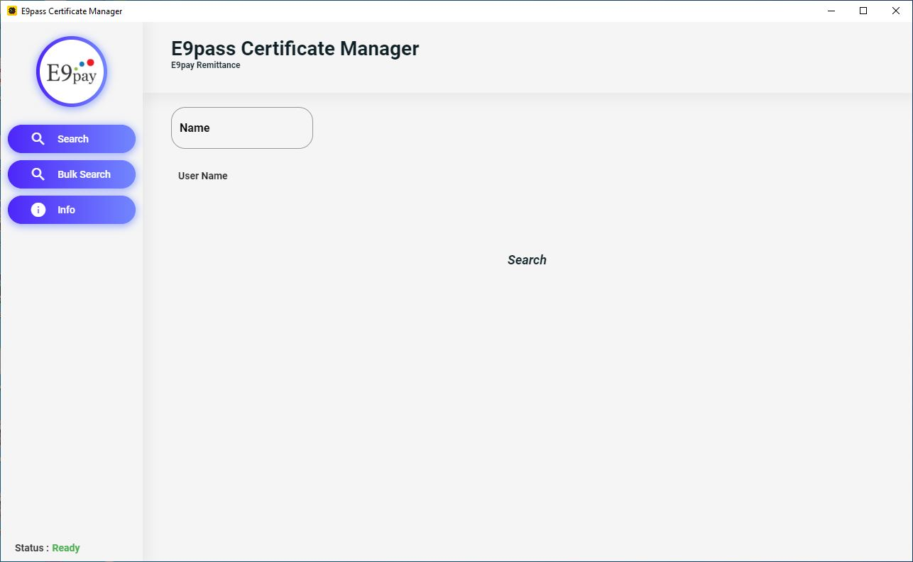

# E9pass Manager

[](https://travis-ci.org/ishangavidusha/E9pass-Desktop-App)

This is a windows desktop application for file management



## Installation

Download application from [here](https://github.com/ishangavidusha/E9pass-Desktop-App/releases/tag/v1.1.9) to install E9pass Manager.

## Build

#### Build Flutter
Install flutter then -
```
flutter build web
```
Copy all the files from build/web to electron/web

#### Python Modules
Install all the requirements from -
```
requirements.txt
```

#### Build Electron
```
npm init
npm run package
```

#### Create Installer
Download and install [Advanced Installer](https://www.advancedinstaller.com/)
Then open file - 
```
E9pass Manager.aip
```

## License
[MIT](https://choosealicense.com/licenses/mit/)
